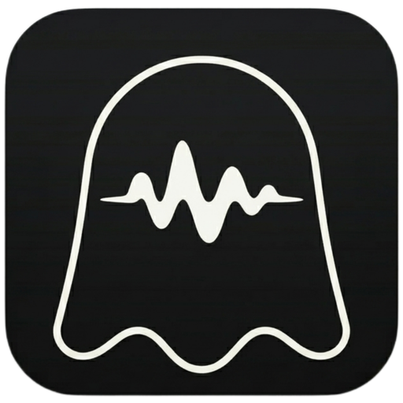

# Whisprer

Whisprer is a free macOS menu bar dictation app.

Core loop:

> Hold `Right Option` → speak → release → text appears

## Install

Download the latest packaged release from GitHub Releases, unzip it, and move `Whisprer.app` into `/Applications`.

The packaged release is:

- Apple Silicon only
- fully self-contained, with `whisper-cli` and the `base.en` model bundled inside the app
- offline after install, simply plug-n-play

## Why

I found myself dictating my prompts more and more often when working with LLMs, since more context -> less iterations and more accurate results. I looked for trustworthy dictating apps and all of them were either paid and/or they didn't have that developer focus I needed. 

So I made Whisprer. A macOs app that uses Whisper under the hood to transcribe, all of it locally (because privacy), with a post-processing touch for that dev character.

## Current Status

WIP

### Features

- Hold `Right Option` to speak, release to insert text into the active app
- Local Whisper transcription with no cloud dependency
- Developer-friendly formatting for spoken code and file references. Uses "the" and file extension names to format, for example:
  - `Please update the developer dictionary.swift file` -> `Please update the @DeveloperDictionary.swift file`
  - `the project management.md` -> `the @project-management.md`
  - currently tuned for common developer file types such as `java`, `kt`, `swift`, `py`, `rs`, `json`, `yaml`, `yml`, `md`, `xml`, `js`, `ts`, `jsx`, and `tsx`
  - intentionally lightweight and conservative, so it only rewrites clearly code-like phrases instead of guessing across normal prose

## Permissions

Whisprer needs:

- microphone permission for recording
- accessibility permission for text insertion

On first launch, macOS will also warn that the app is from an unidentified developer because it is not notarized.

If that happens:

1. Try opening the app once from `/Applications`
2. Open `System Settings -> Privacy & Security`
3. Click `Open Anyway` for Whisprer

After that, the app can be launched normally and macOS will prompt for the native microphone and accessibility permissions.
